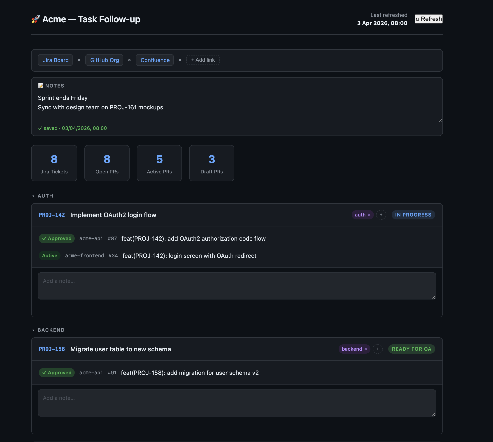

# devboard

A zero-dependency local dashboard that aggregates your open GitHub PRs and Jira tickets in one place.

No framework, no build step, no database — just Python 3 and the `gh` CLI.




---

## What it shows

- All your open PRs grouped by Jira ticket, with **Active / Draft / ✓ Approved** status
- Jira tickets assigned to you with no open PR yet
- PRs with no Jira ticket reference (shown as `NO_JIRA_<number>`)
- Collapsible project groups (labelled manually per ticket)
- Per-ticket notes and a global notes area — all auto-saved
- A bookmarks bar for quick links
- Auto-refreshes every 15 minutes

---

## Requirements

| Tool | Purpose |
|------|---------|
| Python 3 | Runs the local server (stdlib only, no `pip install`) |
| [`gh` CLI](https://cli.github.com/) | Fetches your open PRs from GitHub |
| Jira API token | Fetches ticket status from your Jira instance |

Make sure `gh` is authenticated before starting:

```bash
gh auth status
```

---

## Setup

### 1. Clone the repo

```bash
git clone https://github.com/<your-handle>/task-follow-up.git
cd task-follow-up
```

### 2. Configure your environment

```bash
cp .env.example .env
```

Edit `.env` with your values:

```env
# Display name and emoji shown in the browser tab and header
APP_NAME=My Project — Task Follow-up
APP_EMOJI=🚀

# GitHub organisation to search PRs in
GITHUB_ORG=my-github-org

# Your Jira instance base URL (no trailing slash)
JIRA_BASE_URL=https://my-org.atlassian.net

# Your Jira credentials
JIRA_EMAIL=you@example.com
JIRA_TOKEN=your_api_token_here
```

> **Never commit `.env`** — it is gitignored.

#### Getting a Jira API token

1. Go to <https://id.atlassian.com/manage-profile/security/api-tokens>
2. Click **Create API token**, give it a name, copy the value into `JIRA_TOKEN`.

### 3. Start the server

```bash
python3 server.py
```

Open **<http://localhost:8765>** in your browser.

Leave the terminal running — the server handles refreshes and saves your notes.

---

## Refreshing data

Click the **↻ Refresh** button (or wait — it auto-refreshes every 15 minutes).

The server will:
1. Fetch all your open PRs from GitHub via `gh`
2. Fetch each referenced Jira ticket's status
3. Fetch all Jira tickets assigned to you
4. Embed the updated data into `index.html`
5. Reload the page automatically

---

## Data storage

All user data (notes, labels, bookmarks) is stored in **`user_data.json`** on disk via the local server. Nothing is sent anywhere — everything stays on your machine.

---

## File structure

```
task-follow-up/
├── index.html        # Dashboard UI (data inlined as a JS constant)
├── server.py         # Local HTTP server + /refresh endpoint
├── user_data.json    # Your notes, labels, and bookmarks (auto-created)
├── .env              # Your credentials and config (gitignored)
├── .env.example      # Template — copy to .env and fill in
├── .gitignore
├── LICENSE
└── README.md
```

---

## License

This software is source-available for personal, non-commercial use only.  
Modification and redistribution are not permitted. See [LICENSE](./LICENSE) for full terms.

For commercial licensing, contact: jeremy.dillenbourg@gmail.com


A local dashboard that shows all your open GitHub PRs and Jira tickets in one place.  
Data is fetched live from GitHub (via `gh` CLI) and Jira (via API token) and embedded directly in the HTML — no build step, no framework.

---

## What it shows

- **Tickets with PRs** — Every open PR you authored, grouped by Jira ticket. Each PR is labelled *Active* or *Draft*.
- **Assigned in Jira — no open PR** — Jira tickets assigned to you that don't have a matching open PR yet.
- **No Jira ticket** — Open PRs that don't reference a ticket in their title.
- **Notes** — A freeform note field under each ticket, auto-saved to `localStorage`. Survives page reloads and refreshes.

---

## Setup

### 1. Prerequisites

| Tool | Purpose |
|------|---------|
| `python3` | Runs the local server |
| `gh` CLI | Fetches your open PRs from GitHub (must be authenticated: `gh auth status`) |
| Jira API token | Fetches ticket status and assigned tickets |

### 2. Create a Jira API token

1. Go to: https://id.atlassian.com/manage-profile/security/api-tokens
2. Click **Create API token**, give it a name, copy the value.

### 3. Configure credentials

```bash
cp .env.example .env
```

Edit `.env`:

```env
JIRA_EMAIL=you@example.com
JIRA_TOKEN=your_api_token_here
```

`.env` is gitignored — never commit it.

### 4. Start the server

```bash
python3 server.py
```

Then open: **http://localhost:8765**

Leave the server running in a terminal tab. It stays alive until you stop it (`Ctrl+C`).

---

## Refreshing data

Click the **↻ Refresh** button in the top-right corner of the dashboard.

The server will:
1. Fetch all your open PRs from GitHub via `gh`
2. Fetch ticket details and status from Jira for each referenced ticket
3. Fetch all Jira tickets assigned to you with no open PR
4. Embed the updated data directly into `index.html`
5. The page reloads automatically

> Your notes are stored in the browser's `localStorage` and are **not** affected by refreshes.

---

## File structure

```
task-follow-up/
├── index.html       # The dashboard (data is inlined as a JS variable)
├── server.py        # Local HTTP server + /refresh endpoint
├── .env             # Your credentials (gitignored)
├── .env.example     # Template — copy to .env and fill in
├── .gitignore
└── README.md
```

---

## How it works

```
Browser → GET http://localhost:8765/
        ← index.html (with inlined DATA)

Browser → POST http://localhost:8765/refresh  (on button click)
        → server fetches GitHub PRs via `gh` CLI
        → server fetches Jira tickets via REST API
        → server rewrites the `const DATA = {...}` line in index.html
        ← { ok: true }
        → browser reloads
```

The data lives inside `index.html` as a single `const DATA = {...}` line.  
No separate JSON file needs to be fetched, so the page works without any CORS setup.
